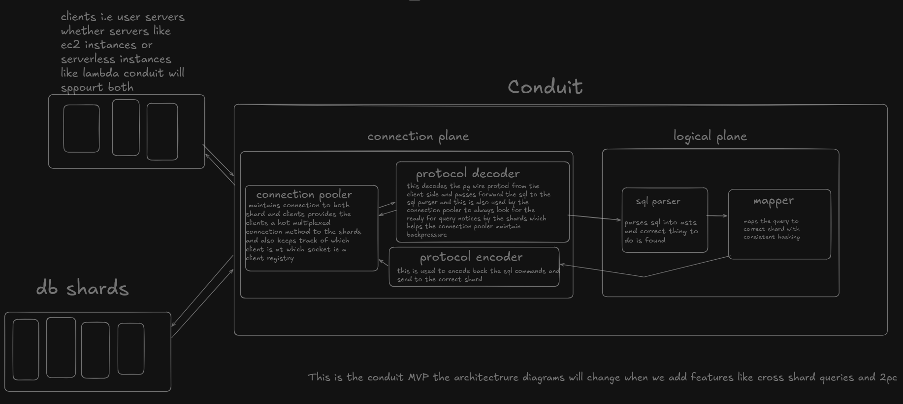

# Conduit
Conduit is a Proxy SQL router which intercepts PostgreSQL wire protocol packets and parses SQL ASTs to transparently route queries across sharded database instances based on consistent hashing. The basic idea behind is to allow user to interact with thier fleet of sharded database instances via a single medium.

# Architecture
Conduit MVP follows the following architecture :

