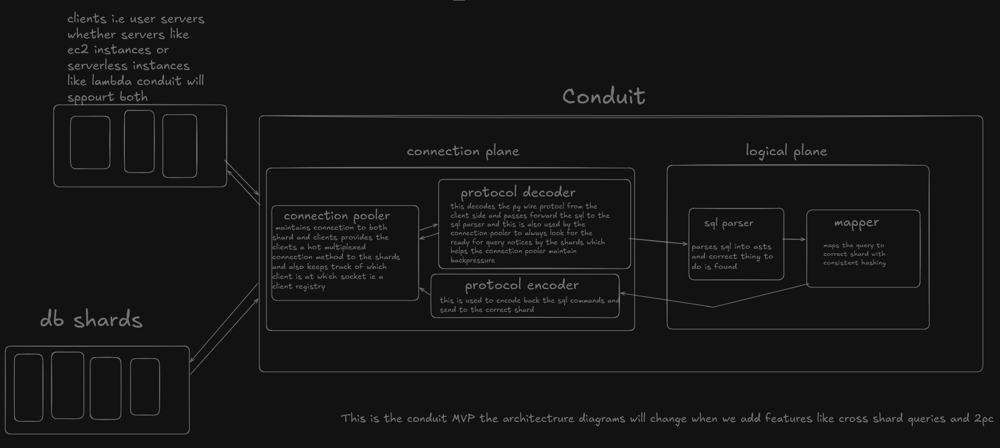

# CONDUIT ARCHITECTURE DETAILS 

Conduit MVP follows the following architecture :

**CONNECTION PLANE :**  

**Connection Pooler :**
Conduit maintains a "warm" pool of 10 authenticated SSL connections per shard. This eliminates the handshake latency for incoming clients. By leveraging the Protocol Decoder, the pooler multiplexes these connections: as soon as a query completes (indicated by a ReadyForQuery message), the shard connection is detached from the client and returned to the pool. This architecture provides high-efficiency support for both long-lived VPS clients and serverless functions (e.g., AWS Lambda). Also Conduit is Stateful. It tracks the current lifecycle of a client session (Handshaking $\rightarrow$ Authenticating $\rightarrow$ Streaming $\rightarrow$ Idle) to ensure that shard connections are never released while a transaction is still open.

**Protocol Decoder :** This layer performs deep packet inspection of the PostgreSQL wire protocol. It reconstructs full messages from fragmented TCP streams, allowing Conduit to "peek" into the protocol state. It specifically watches for the ReadyForQuery (Z) signal to manage the multiplexing lifecycle and extracts the Query (Q) messages to be passed to the Logical Plane. *

**Protocol Encoder :** The Encoder acts as the "Mouth" of Conduit. It wraps internal data (such as "Shard Offline" errors or internal conduit errors) into the standard Postgres [Type][Length][Payload] boxcar format. This ensures that the client driver perceives Conduit as a native PostgreSQL instance, maintaining protocol integrity even when Conduit is interjecting its own logic.
